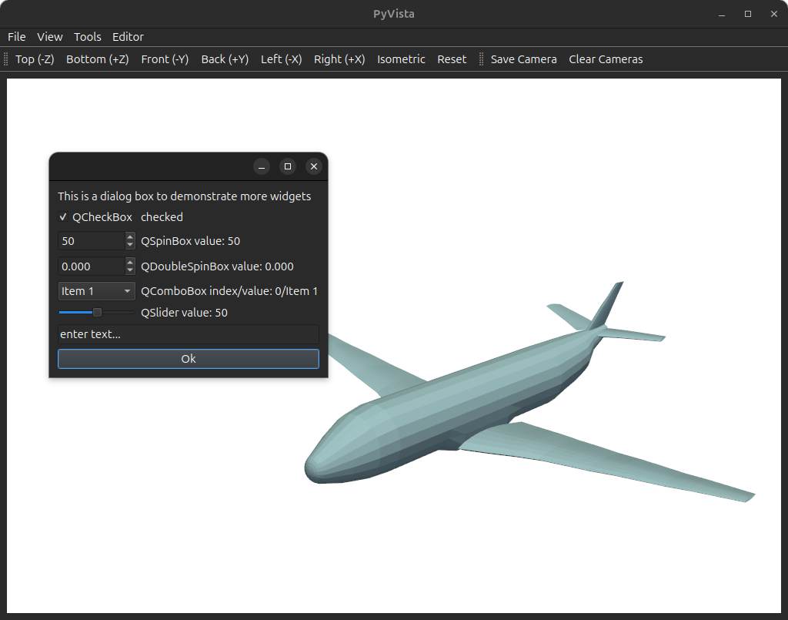

# PyVista/Qt tutorial for interactive 3D plotting in Python

This tutorial is available as a Jupyter notebook [tutorial.ipynb](tutorial.ipynb) and as an [html page](https://thibaultlejemble.github.io/Tutorial-PyVista-Qt/).